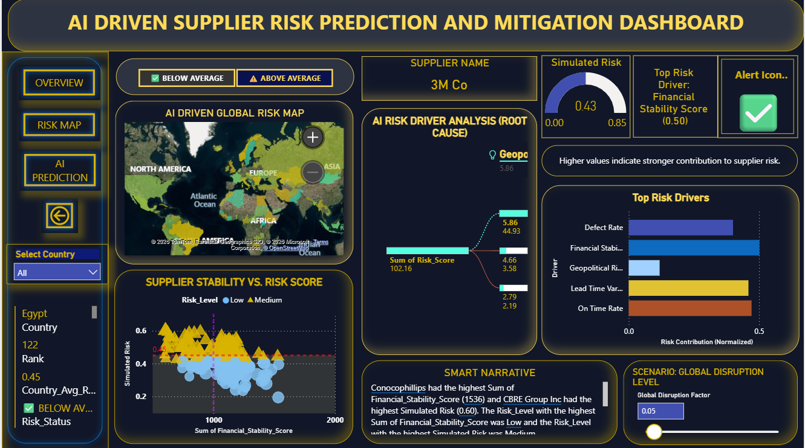

# AI-Driven Supplier Risk Prediction & Mitigation Dashboard
**By Dnyaneshwari Narhare** | *Master of Engineering Management, SJSU*

##  Project Overview
This project addresses supply chain volatility by transitioning from reactive monitoring to proactive AI-driven risk prediction. Using machine learning, the system identifies high-risk suppliers before disruptions occur, allowing for optimized stocking and mitigation strategies.

##  Technical Stack
- **Languages:** Python (Pandas, NumPy)
- **Machine Learning:** XGBoost, Scikit-learn
- **Explainable AI:** SHAP (SHapley Additive exPlanations)
- **Visualization:** Power BI, Seaborn, Matplotlib

##  Key Performance Indicators (KPIs)
- **Supplier Risk Score:** Predictive index based on lead time and defect rates.
- **On-Time Delivery (OTD):** Benchmarking vendor reliability.
- **Financial & Geopolitical Risk:** Integrating external datasets for holistic scoring.
- **Lead Time Variability:** Identifying bottlenecks in the procurement cycle.

##  Dashboard Preview

*Figure 1: Power BI Executive Overview highlighting supplier risk clusters and KPI trends.*

##  Key Features
1. **Predictive Modeling:** Utilizes XGBoost to classify suppliers into High, Medium, and Low risk tiers.
2. **Interpretability:** Uses SHAP beeswarm plots to show exactly which factors (e.g., Lead Time vs. Quality) are driving a supplier's risk score.
3. **Interactive Simulation:** Power BI dashboard allows supply chain managers to perform "What-If" analysis on potential vendor disruptions.

##  Repository Structure
- `ISE 298 Dnyaneshwari Narhare.ipynb`: End-to-end Python pipeline (Data cleaning to ML).
- `requirements.txt`: Environment configuration for reproducibility.
- `ISE 298 FINAL PROJECT DASHBOARD.pbix`: Source file for the interactive dashboard.
- `visuals/`: High-resolution screenshots of the analytical outputs.
